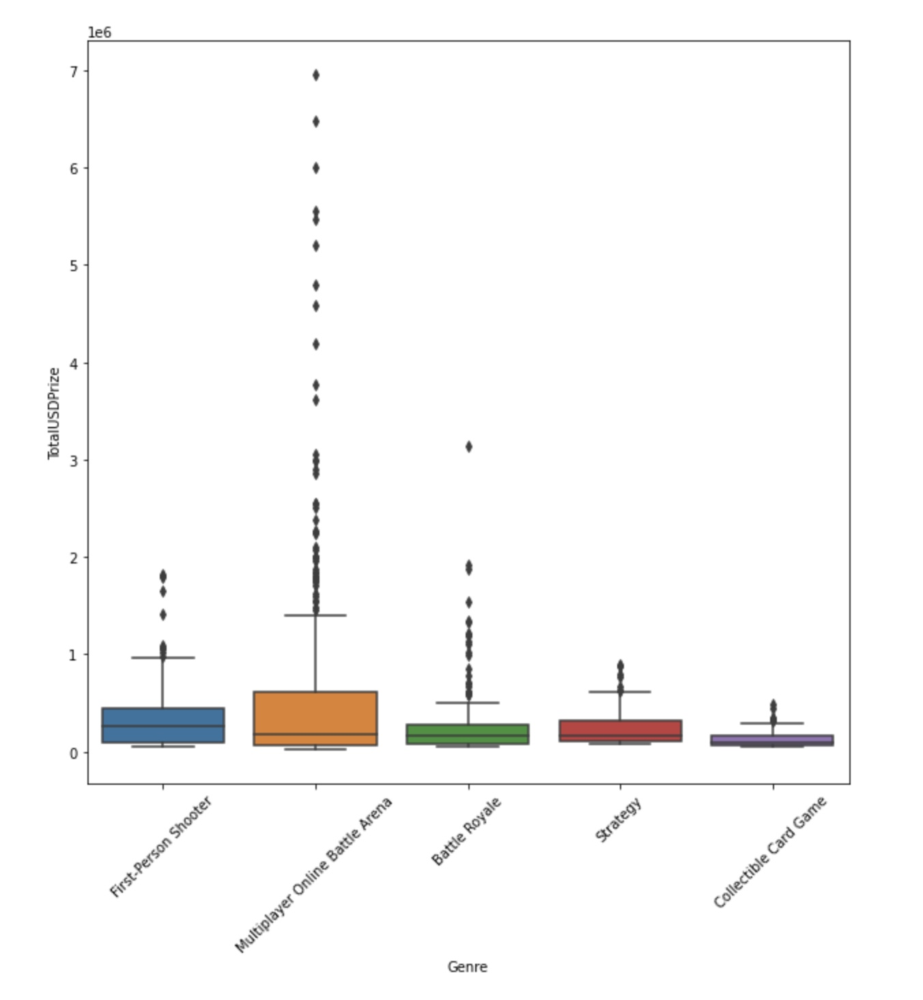

# Project of Data Visualization (COM-480)

| Student's name | SCIPER |
| -------------- | ------ |
| Li Shanci | 322772 |
| Luo Ruizhi | 323100 |
| Yu Aibin | 336380 |

[Milestone 1](#milestone-1) • [Milestone 2](#milestone-2) • [Milestone 3](#milestone-3)

## Milestone 1 (8th April, 5pm)

**10% of the final grade**

### Dataset

The dataset is eSports earnings which is extracted from the kaggle. It provides information on the earnings of eSports players and teams. 

Link: https://www.kaggle.com/code/derisnoor/esports-earnings-eda/data

The dataset includes about 2k entries, corresponding to the detailed earnings of eSports players and teams from different countries and regions in 10 games such as Dota2, Fortnite, League of Legends, and so on.

The dataset is clean, we did not observe out-of-range numerical values or digital gibberish in-text attributes. It is ready for data exploration and visualization.

### Problematic

#### Overview 
The topic of our visualization project is to explore the earnings of eSports players and teams. The current scenes have been designed as follows:

1. The audience will be welcomed by a standard title sequence and a nice eSports picture.
2. The second scene showcases the 5 most popular of the 10 games. Clicking on a node triggers the game's theme song, and a brief intro to the game will be given. 
3. In the next scene, there is a heat map of the world that visualizes the average salary of esports players from different continents and countries. 
4. The fourth scene will present the player and the team with the highest earnings in different countries or continents by clicking different regions of the world heat map.

#### Motivation: 
Over the past few years, the eSports industry has been growing, the number of viewers watching these games has increased every year, eSports professional players and video game streaer have become a promising career.

However, people usually do not have an intuitive understanding of the income of e-sports practitioners. We hope to find out what the most popular games are currently through some data exploration and analysis, and display the income of players and teams interactively. We hope that our visualization could help the new gamers or pro gamers to decide which game to learn first or learn next based on popularity and which region is more promising based on the average salary.

#### Target audiences 
* Teenagers who have talents in esports and want to be a professional player or vedio game streamer in the future. They need to search for the income of the top players in the field for the decision-making of their future career plan. For example, they want to know which gaming will let them earn more salary in the same genre.

* Investigators and advertising sponsor who want to promote their product in the tournament or the live streaming like Twitch. The salary of the practitioners the amount of the sponsorship will give them a general information about the popularity of the different games and the budget they need.

### Exploratory Data Analysis

#### About Data 

* The data includes 10 games and we can classify them according to the 5 genres.

|            **Genre**            |                           **Game**                           | Count |
| :-----------------------------: | :----------------------------------------------------------: | :---: |
|          Battle Royale          |                       [Fortnite, PUBG]                       |  200  |
|      Collectible Card Game      |                        [Hearthstone]                         |  80   |
|      First-Person Shooter       |        [Overwatch, Counter-Strike: Global Offensive]         |  200  |
| Multiplayer Online Battle Arena | [League of Legends, Dota 2, Heroes of the Storm, Arena of Valor] |  348  |
|            Strategy             |                        [Starcraft II]                        |  100  |

* A team can appear more than once but note that it is a different game.
* Since there are some star players in each game. There are lots of  'outliers' in the data, so using median is much better than mean.

Our data exploratory analysis and visualization are mainly based on the teams, players and country&continent point of view, which conclusively provides the following findings. 

#### From the team point of view

Changes of data along different seasons can be the reflection of the rise and fall of teams and indication of interesting historical events, thus serving as a vital perspective.

- From the season 2008/2009 to 2015/2016, the number of matches and total participating teams remains roughly constant over time, and the average is 3247 and 185 respectively.
- In leagues, the proportion of the number of teams participating in the season to the total number of teams is basically between 55-70%. And this statistic remains roughly unchanged over time. The proportion reaches its highest value in the case of Belgium Jupiler League in season 2008/2009, which is 75%. Interestingly, it drops dramatically in season 2013/2014 due to missing data, which is merely 16.7%, and returns to normal in the next two seasons.
- 92 teams participated in all the seasons, and 51 teams participated only once, accounting for 31% and 17% of all teams respectively. Besides, the number of teams participating twice to seven times is similar, accounting for 8.6% of all teams in average.
- **From the team point of view:**

Since goals and ranking of a team is of great concern by soccer fans, such team-oriented information will also be a key focus in this project.

- Juventus from Italy Serie A got 102 points in season 2013/2014, the highest points in history. And the teams which obtained the top five low points in history are all from Belgium Jupiler League.
- Celtic and FC Barcelona are the only two teams that enter the top 10 points every season. FC Barcelona is the team that won the most champions, which is four times in eight seasons.
- FC Barcelona, Real Madrid CF and Celtic are the top 3 high average points teams.
- The best new team in history is Manchester United. It won 90 points when first participating in the 2008/2009 season.
- There are 34 teams with the largest number of matches, which is 304. While the smallest number of matches is 30, obtained by 6 teams.
- The team is more likely to win as a home team rather than an away team, with more average team goals in the match.
- **From the player point of view:**

Other than the two previous points of view, data of players, such as weight, height, age and even the preferred foot will also be studied in the project to fulfill the curiosity of those who are interested.

- For all players, the average height is 181.87cm and average weight 168.38g. The average age in their participating seasons is about 25 and remains almost the same over time.
- About 75.7% of the players prefer to play with the right foot and 23.5% play with the right one.
- Lionel Messi has the highest overall rating , which is 94, and has kept it for four seasons.

### 

### Related work

> - What others have already done with the data?

1. [esports_earnings_EDA](https://www.kaggle.com/code/derisnoor/esports-earnings-eda)

2. [eSports Earnings: Data Visualization and Exploration](https://www.kaggle.com/code/hbakker/esports-exploratory-analysis)

3. [e_sport_data_explore](https://www.kaggle.com/code/jefsuu/e-sport-data-explore)

4. [Esports: Exploratory Analysis](https://www.kaggle.com/code/hbakker/esports-exploratory-analysis)

> - Why is your approach original?

Most of the Exploratory Data Analysis of the above related works use static visualization and only present statistics values. We want to perform the visualization more interactive and more interesting. Besides the necessary values to show, we would like to use more logos, music and convert the tables to interactive UI blocks. Through our informative design and considerate introduction, the audience can acknowledge the general information of the industry quickly and precisely even if they do not know about the field before.

> - What source of inspiration do you take? Visualizations that you found on other websites or magazines (might be unrelated to your data).

1.  [eSports: Should You Start a Startup?](https://public.tableau.com/app/profile/jack.daoud/viz/eSportsReport/Story)
* This is the project created by the publisher of the dataset. Combined with other datasets, he presents several aspects of the esports industry vivid and informatively.

2. [Esports Viewership Stats for 2018](https://escharts.com/2018) 
* Esports Charts is a unique analytical agency collecting all information about esports, streaming and providing actual fact data. In this web page, they visualized the viewership statistics for 2018. They showed lots of statistics while most of them are bar charts and non-interactive. However, we like the background layout and the way they use dynamic visualization of static bar values.

## Milestone 2 (6th May, 5pm)

**10% of the final grade**

## Milestone 3 (3rd June, 5pm)

**80% of the final grade**

## Late policy

- < 24h: 80% of the grade for the milestone
- < 48h: 70% of the grade for the milestone
